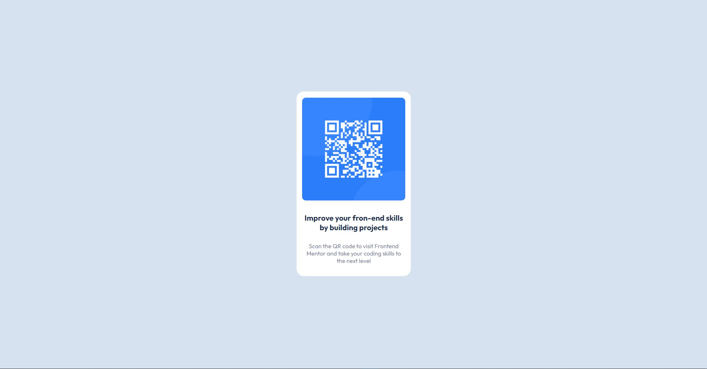

# Frontend Mentor - QR code component solution

This is a solution to the [QR code component challenge on Frontend Mentor](https://www.frontendmentor.io/challenges/qr-code-component-iux_sIO_H). Frontend Mentor challenges help you improve your coding skills by building realistic projects. 

## Table of contents

- [Overview](#overview)
  - [Screenshot](#screenshot)
  - [Links](#links)
- [My process](#my-process)
  - [Built with](#built-with)
  - [What I learned](#what-i-learned)
  - [Continued development](#continued-development)
  - [Useful resources](#useful-resources)
- [Author](#author)

## Overview

### Screenshot

### Links

- Solution URL: [My Solution](https://github.com/AdhemarRomero/QR-code-component-Challenge)
- Live Site URL: [GitHub Pages](https://adhemarromero.github.io/QR-code-component-Challenge/)

## My process

### Built with

- Semantic HTML5 markup
- CSS custom properties
- Flexbox
- CSS Grid
- Mobile-first workflow

### What I learned

In this project I reinforced that knowledge acquired in a self-taught way. However, I learned to realize, what types of measures to use depending on the context, in the css.

### Continued development

Just as I've learned things, I know I don't have clean code yet. So I will keep practicing to improve.

Any comments on this or other projects would be very helpful.

### Useful resources

- [Screen height](https://desarrolloweb.com/faq/css-height-100) - This helped me, since I didn't remember how to set the full height of the screen.

## Author

- LinkedIn - [Adhemar Romero](https://www.linkedin.com/in/adhemar-alessandro-romero-urbina/)
- Frontend Mentor - [@AdhemarRomero](https://www.frontendmentor.io/profile/AdhemarRomero)
- GitHub - [AdhemarRomero](https://github.com/AdhemarRomero)
